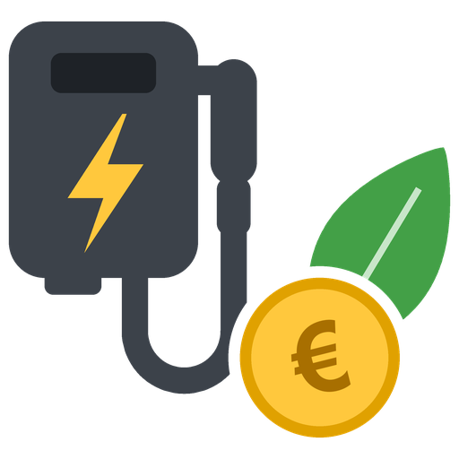

# ERE-laadrapport voor Home Assistant

Maakt per kwartaal een rapport van wat je laadpaal heeft geleverd, bedoeld als bewijsstuk bij het
inboeken van ERE's (emissiereductie-eenheden) via een inboekdienstverlener.

*English summary: a Home Assistant custom integration that records EV charging sessions from any
cumulative kWh sensor and produces a quarterly xlsx/csv report for the Dutch ERE scheme. The
integration is available in Dutch and English; the report language is a setting (Dutch by default).*

## Lees dit eerst

- **Dit is geen koppeling met een inboeker.** Je krijgt een bestand dat je zelf uploadt.
- **De data komt uit Home Assistant, niet uit de backend van je laadpaal.** Of een inboeker en diens
  verificateur dat accepteren, bepalen zij. Vraag het na voordat je erop rekent.
- **Kies de sensor van de MID-meter in je laadpaal.** Voor particulieren eist de NEa een
  MID-gecertificeerde meter die in de laadpaal is geïntegreerd; zonder die meter kun je geen ERE's
  aanvragen. De integratie kan niet controleren welke meter een sensor uitleest. Het rapport noemt
  daarom de gebruikte sensor, zodat je inboeker dat kan nagaan.

## Wat het doet

- Volgt een oplopende kWh-sensor en legt elke laadsessie vast met tijd en meterstand bij start en stop.
- Maakt op de eerste dag van een nieuw kwartaal automatisch een rapport over het vorige kwartaal.
- Het rapport opent met de meterstand aan het begin en eind van het kwartaal; dat verschil is het
  getal dat je inboekt. De sessies zijn de onderbouwing.
- Verbruik dat niet aan een sessie is toegewezen, staat er als apart getal bij.
- Voor periodes vóór de installatie worden sessies gereconstrueerd uit de uurstatistieken van
  Home Assistant. Die sessies zijn op hele uren afgerond en als zodanig gemarkeerd.

## Installatie

### 1. Downloaden via HACS

Klik op de knop. HACS opent deze repository in je eigen Home Assistant. Kies **Downloaden** en
herstart Home Assistant.

Werkt de knop niet?

Ga in HACS naar het menu (⋮) → **Aangepaste repositories**. Vul
`https://github.com/DannyOosterveer/ha-ere-report` in, kies type **Integratie** en klik op
**Toevoegen**. Zoek daarna "ERE Charging Report" en kies **Downloaden**.

### 2. Integratie toevoegen

Klik op de knop, of ga naar Instellingen → Apparaten & diensten → Integratie toevoegen →
"ERE Charging Report".

Kies daarna de sensor met de meterstand van je laadpaal en vul de gegevens voor het rapport in.
De keuzelijst toont eerst alleen sensoren die op een laadpaalmeter lijken. Staat jouw sensor er
niet bij, vink dan "Alle energiesensoren tonen" aan.

De sensor moet `device_class: energy` hebben en langetermijnstatistieken opbouwen
(`state_class: total_increasing`). Bij een Alfen met de Alfen Wallbox-integratie is dat
"Meter Reading" van de socket.

## Het rapport

Bestanden komen in `config/ere_reports/`, bijvoorbeeld `ere_laadpaal_2026_q3.xlsx` en `.csv`.
De map `www/` wordt bewust niet gebruikt: die is zonder inloggen bereikbaar en het rapport bevat je
adres en EAN-code. Om dezelfde reden kunnen alleen beheerders de rapporten zien en downloaden.

Je vindt de rapporten op drie plekken:

- **ERE-rapporten** in de zijbalk: alle rapporten met downloadknoppen, en per laadpunt een knop om
  een rapport voor een gekozen kwartaal te maken. De uitkomst of foutmelding verschijnt er direct onder.
- **Meldingen** (het belletje): na elk rapport een melding met downloadlinks. Als het automatische
  kwartaalrapport mislukt, staat ook dat hier.
- **Logboek**: na elk rapport een regel als "heeft het rapport Q3 2026 gemaakt: 805,12 kWh,
  37 sessies", gekoppeld aan wie of wat het rapport startte.

| Tabblad | Inhoud |
| --- | --- |
| Samenvatting | Naam, adres, EAN, laadpaal, meterstand begin en eind, geleverde kWh, opmerkingen |
| Sessies | Per sessie: start, eind, duur, meterstand start en eind, kWh, herkomst |
| Maandtotalen | Per maand: aantal sessies, kWh uit sessies, kWh volgens de meter |

Herkomst van een sessie:

| Herkomst | Betekenis |
| --- | --- |
| live gemeten | Start en stop zijn gezien terwijl Home Assistant de meter volgde |
| niet live waargenomen | Verbruik tijdens een herstart of terwijl de sensor onbeschikbaar was; de starttijd is onzeker |
| gereconstrueerd uit uurwaarden | Achteraf bepaald uit statistieken, afgerond op hele uren |

## Handmatig een rapport maken

- Knop "Rapport maken" op de pagina ERE-rapporten, voor elk kwartaal.
- Knop "Rapport vorig kwartaal maken" op het apparaat. Een knop in Home Assistant toont als status
  alleen het tijdstip waarop hij is ingedrukt; de uitkomst zie je in het logboek, bij de sensor
  "Laatste rapport" en in de melding. Gaat het mis, dan krijg je direct een foutmelding in beeld.
- Actie `ere_report.generate_report` met optioneel `year` en `quarter`. De actie geeft de
  bestandspaden en totalen terug, zodat je er een automatisering aan kunt hangen.
- Na elk rapport wordt de gebeurtenis `ere_report_generated` afgevuurd met dezelfde gegevens.

Een rapport over een kwartaal dat nog loopt, wordt als voorlopig gemarkeerd.

## Entiteiten

| Entiteit | Betekenis |
| --- | --- |
| Energie dit kwartaal | Meterstand nu min de meterstand aan het begin van het kwartaal |
| Sessies dit kwartaal | Aantal vastgelegde sessies |
| Energie laatste sessie | kWh van de laatste sessie, met start, eind en meterstanden als attributen |
| Sessie actief | Aan zolang er een sessie loopt |
| Laatste rapport | Tijdstip van het laatste rapport, met periode, kWh en sessies als attributen |

## Instellingen

Via "Configureren" pas je de rapportgegevens aan en stel je de sessiedetectie af:

- **Sessie beëindigen na** (standaard 15 minuten zonder verbruik). Zet dit hoger als je auto
  tussendoor lang pauzeert, bijvoorbeeld bij laden op zonnestroom.
- **Taal van het rapport**: Nederlands (standaard) of Engels. De bediening in Home Assistant volgt
  de taal van je Home Assistant.
- **Kleinste sessie** (standaard 0,05 kWh). Kleiner verbruik telt wel mee in het totaal, maar wordt
  geen sessie.

## Beperkingen

- Een sessie wordt herkend aan de meterstand, niet aan het insteken van de stekker. Eén laadbeurt
  met een lange pauze wordt twee sessies.
- Bidirectioneel laden wordt niet ondersteund; voor ERE telt alleen de netto geleverde kWh.
- Eén meter per laadpunt. Voor een laadpaal met twee sockets voeg je de integratie twee keer toe.
